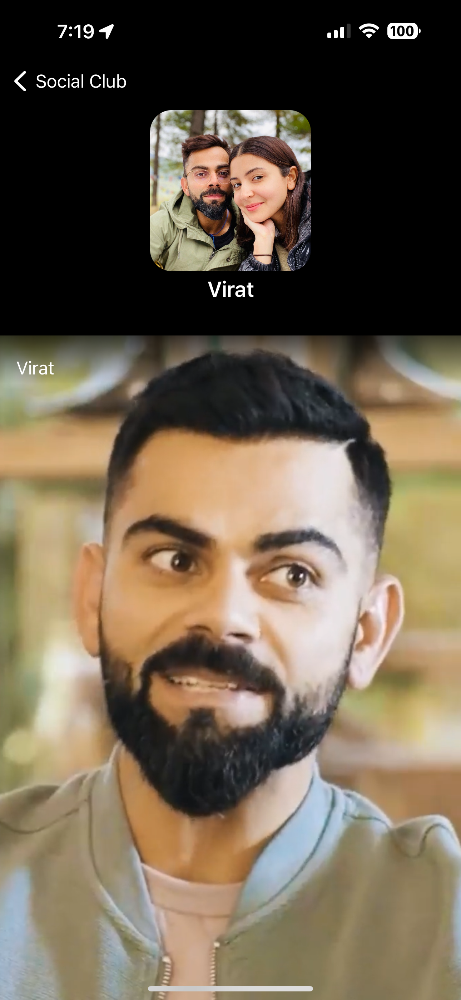

# Social Club

|         Home        |        Post        |       Profile         |
| ------------------- | ------------------ | --------------------- |
|   |  |  |

https://github.com/srvarma7/SocialVideoClub/assets/48859937/ee82a50c-09fd-48c4-9362-92c7bb33091d

 
## UI inspiration from Instagram
    - As it is heavy in video content
    - and have a benchmark for standards 

The application has 3 screens
    
    1. Home feed 
        - A list of video appear on feed.
        - Each video should show the video content, the username of the uploader, and the number of likes.
        - Ability to refresh feed.
        
    2. Post details screen
        - On tapping a post on feed, screen is redirected to Post screen with additional details of the post like user image and like button.
        
    3. Profile screen
        - On tapping username or user image, profile screen is displayed with all the created posts associated with the user

## Tasks

1. Home Screen (Feed):
   
    **Done** - Display a feed of videos from various users.
   
    **Done** - Each video should show the video content, the username of the uploader, and the number of likes.
   
    **Done** - Implement a "pull-to-refresh" feature to reload the feed.
    
    ### Additionally,
   
    **Done** - Pagination is implemented. Pagination calls goes out as soon as the scroll is near the end of list.
   
    **Done** - A clever mechanism to auto play video on scroll.
   
    **Done** - Loops the video on playing till the end.

3. Post Page:

   **Done** - Display the video content, the user's profile details (username, profile picture, etc.), and a like button.
    
    ### Additionally,
   
    **Done** - Added support to show posts related or tending posts in the platform
   
    **Done** - Tapping on username or user image, profile screen is displayed with all the created posts associated with the user

5. Profile Page:
   
    **Done** - Show the user's profile information, including their username and profile picture. - Display a grid or list of posts that the user has created.

# Tech
## Navigation
    - App navigation has been implemented using coordinator pattern.
    - It avoids the tight coupling between view controllers.
    - Enables a centralized app navigation.
    - Helpful in Deep-linking the app to different screens.

## Architecture
    - Used MVVM pattern to keep the code clean and readable.

## API data
    - API data is hosted on GitHub repo.

## Network
    - Network calls are made using URLSession.
    - A base network layer is written to make the API calls with the help of Generics.
    - Simply conform the new service to the `ServiceType`, the wrapper takes care of the rest.
    - Helpful in scaling and maintaining the app in future and by other developers.
    - implemented both in completion handler way and async/away way.

# Future enhancements and good to have items
    - AVPlayer initialization before the video cell is rendered on the screens. 
    - Player caching can be implemented for prefetching the player item for extra smooth UX and reduce hitch time.
    - Play duration progress can be saved to continue the progress when viewed again according to the business logic.
    - Addition of Texture/AsyncDisplayKit/IGListKit for rendering collection UI can hugely enhance the performance and scalability.
    - Additions of a toggle to enable/disable auto play.
    - Mute/unmute button.
    - Long press to pause/play video.
    

# Callout
    - Forced the interface to use dark mode, it provides rich and decent look for a video heavy content app.
